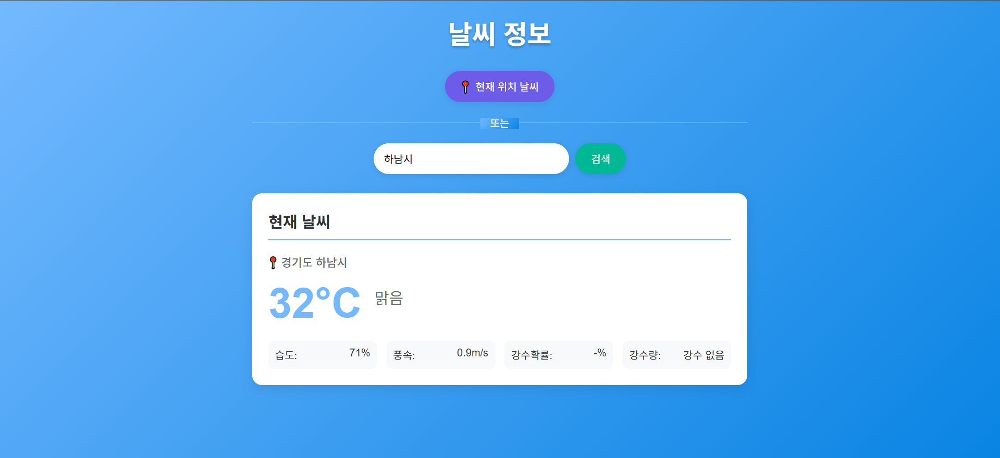

# Weather Reporter

실시간 날씨 정보를 제공하는 웹 애플리케이션입니다. GPS 좌표나 지역명을 통해 현재 날씨와 예보를 확인할 수 있습니다.

## 기술 스택

### Backend
- **Spring Boot 3.x** - Java 웹 프레임워크
- **Spring WebFlux** - 비동기 리액티브 프로그래밍
- **Spring Data JPA** - 데이터베이스 접근
- **MySQL** - 관계형 데이터베이스
- **Apache POI** - Excel 파일 처리

### Frontend
- **Vue.js 3** - 프론트엔드 프레임워크
- **Vite** - 빌드 도구
- **JavaScript** - 프로그래밍 언어

### External API
- **기상청 API** - 날씨 데이터 제공

## 주요 기능

- 📍 **GPS 기반 날씨 조회**: 현재 위치의 실시간 날씨 정보
- 🏙️ **지역명 검색**: 원하는 지역의 날씨 정보 검색
- 🌡️ **상세 날씨 정보**: 온도, 습도, 풍속, 강수확률, 강수량
- 📊 **공간 인덱싱**: MySQL 공간 함수를 이용한 효율적인 위치 검색
- 📋 **Excel 데이터 처리**: 좌표 데이터를 데이터베이스로 자동 임포트

## 설치 및 실행

### 필수 요구사항
- Java 17+
- Node.js 16+
- MySQL 5.7.41

### 1. 저장소 클론
```bash
git clone https://github.com/your-username/weather-reporter.git
cd weather-reporter
```

### 2. 데이터베이스 설정
MySQL에서 데이터베이스를 생성합니다:
```sql
CREATE DATABASE location_qa;
```

MySQL 5.7 이하인 버전에서는 아래와 같이 공간 인덱스 설정
```sql
-- 1. POINT 컬럼 추가
ALTER TABLE locations ADD COLUMN coordinates POINT;
-- 2. 기존 데이터로 업데이트
UPDATE locations SET coordinates = POINT(longitude, latitude) WHERE coordinates IS NULL;
-- (옵션) 만약 NULL 로 컬럼 생성했다면
ALTER TABLE locations MODIFY coordinates POINT NOT NULL;
-- 3. 공간 인덱스 생성
CREATE SPATIAL INDEX idx_coordinates ON locations(coordinates);
```

### 3. 환경 설정
`src/main/resources/application.yml` 파일을 생성하고 다음과 같이 설정합니다:
```yaml
spring:
  application:
    name: weather-reporter
  profiles:
    active: dev
  
  datasource:
    url: jdbc:mysql://localhost:3306/location_qa?useSSL=false
    username: your_db_username
    password: your_db_password
    driver-class-name: com.mysql.cj.jdbc.Driver
    
  jpa:
    hibernate:
      ddl-auto: update
    show-sql: true

weather:
  api:
    kma:
      url: https://apis.data.go.kr/1360000/VilageFcstInfoService_2.0
      key: your_weather_api_key
```

API 키는 https://www.data.go.kr/tcs/dss/selectApiDataDetailView.do?publicDataPk=15084084 이 사이트에서 사용신청 한 후에 key 에 넣고 사용하시면 됩니다.

.env 파일 생성 후 application-prod.yml 에 있는 환경변수를 채워주시면 됩니다.

### 4. 백엔드 실행
```bash
./gradlew bootRun
```

### 5. 프론트엔드 실행
```bash
cd frontend
npm install
npm run dev
```

애플리케이션이 다음 주소에서 실행됩니다:
- Frontend: http://localhost:3000
- Backend API: http://localhost:8080

## API 엔드포인트

### 날씨 조회
```
GET /api/weather/current?lat={위도}&lon={경도}
GET /api/weather/current?location={지역명}
```

### 예보 조회
```
GET /api/weather/forecast?lat={위도}&lon={경도}
GET /api/weather/forecast?location={지역명}
```

### 위치 검색
```
GET /api/locations/search?query={검색어}
```

## 프로젝트 구조

```
weather-reporter/
├── src/main/java/com/company/weatherreporter/
│   ├── controller/          # REST API 컨트롤러
│   ├── service/            # 비즈니스 로직
│   ├── repository/         # 데이터 접근 계층
│   ├── entity/            # JPA 엔티티
│   ├── dto/               # 데이터 전송 객체
│   └── config/            # 설정 클래스
├── src/main/resources/
│   ├── application.yml    # 개발 환경 설정
│   └── application-prod.yml # 운영 환경 설정
└── frontend/
    ├── src/
    │   ├── components/    # Vue 컴포넌트
    │   └── services/      # API 서비스
    └── package.json
```

## 주요 기술적 특징

- **공간 인덱싱**: MySQL의 `ST_Distance_Sphere` 함수를 사용한 효율적인 좌표 기반 검색
- **리액티브 프로그래밍**: Spring WebFlux와 Mono/Flux를 활용한 비동기 처리
- **CORS 설정**: 프론트엔드-백엔드 간 안전한 통신
- **에러 핸들링**: 재시도 메커니즘과 타임아웃 설정으로 안정적인 API 호출
